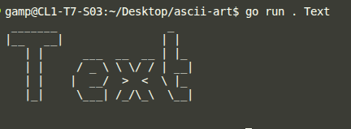
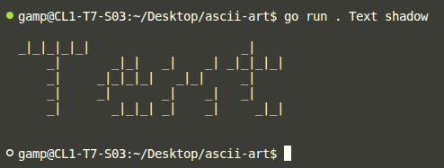
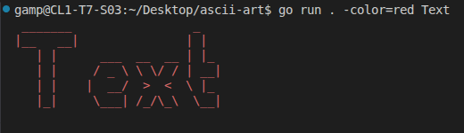
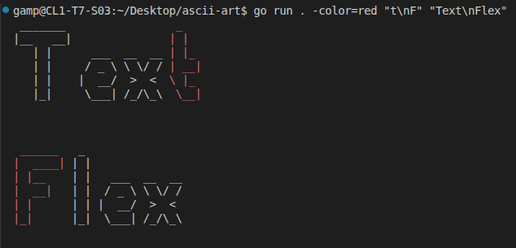
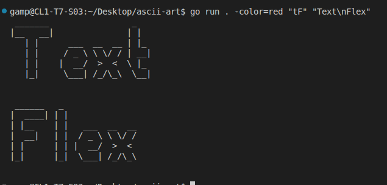
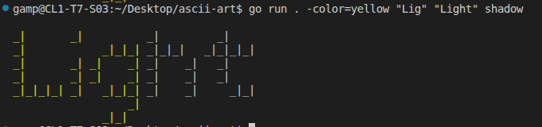

# ASCII Art Color
Ascii Art Color is a CLI program written in Go Language that draws the ASCII art of the ASCII text you pass to it as an argument and colors the substring you can optionally provide.

It uses only the standard libraries of Go language. 

It uses banner files that have the art for each character arranged in the order of the ASCII table and separated by a newline.

It only works for ASCII characters. Unicode characters beyond the [ASCII table](https://www.ascii-code.com/) will cause errors.

Command characters apart from newlines will cause panics.

Making it iterative, character by character drawing, with ANSI Control Sequences was a novel experience.

I hope to be able to expand the project to more than just ASCII characters.

## Installation
- Ask to be a collaborator
- `git clone https://acad.learn2earn.ng/git/obolarinw/ascii-art-color.git`

## Usage
- Change directory to the `ascii-art-color` folder
- Run `go run . --color=<color>OPTIONAL <substring to be colored>OPTIONAL <text to draw>` in the terminal
- To use a style other than the standard style. 
- - Ensure that the banner file of the style is in the `banners` folder as a `.txt` file.
- - Ensure the banner file is formatted properly as described in the project description.
- - Run `go run . --color=<color>OPTIONAL <substring to be colored>OPTIONAL <text to draw> <style banner file name without .txt>OPTIONAL`

- The program gives an error if there is no text or if the color is invalid.
- The valid colors are: black, red, green, yellow, blue, magenta, cyan, white, default

## Demo
### Basic Usage

### With two arguments (text and banner style)

### With color flag and text argument

### With color flag, substring and text containing the substring

### With color flag, substring and text that doesn't contain the substring

### With color flag, substring, text containing the substring and banner style, shadow

## Credits
- [Olamide Ifarajimi](https://acad.learn2earn.ng/git/oifaraji) (Developer)
- [Opeoluwa Adekunle](https://acad.learn2earn.ng/git/oadekunle) (Tester)
- [Oladimeji Bolarinwa](https://acad.learn2earn.ng/git/obolarinw) (Team Lead)

## License
Copyright © 2026

This Project is [GPL](https://www.gnu.org/licenses/gpl-3.0.en.html) Licensed